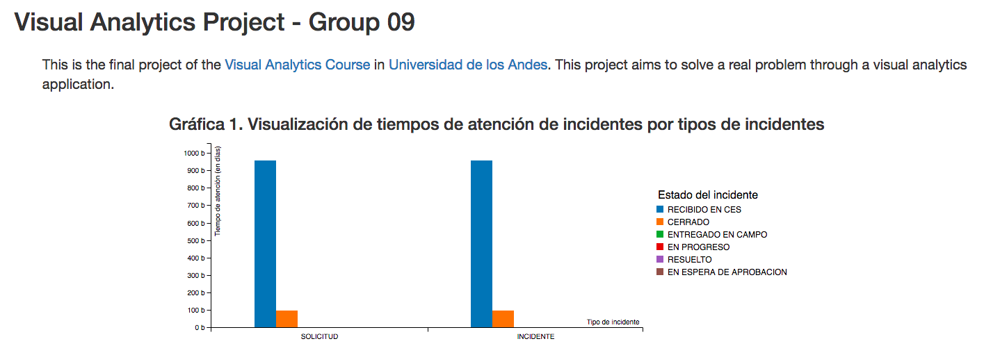

# Visual Analytics Project - Group 09

This is the final project of the [Visual Analytics course](http://johnguerra.co/classes/isis_4822_fall_2016/) in [Universidad de los Andes](http://www.uniandes.edu.co/). This project aims to solve a real problem through a visual analytics application. 

## Project definition

Along this project we will be working with Recaudo Bogotá S.A.S. This enterprise won the pledge for operating 'Sistema de Recaudo' during 17 years. Their mission is to give Bogota citizens an intelligent and quality transportation service, trying to improve their quality life. 
This business is focused on the different services that a variety of cards offer:
- Basic card: The user is nos identified and does not offer any other service beside the opportunity to use the public transport.
- Plus card: It has the name and identification of the user and gives them the option to have discount on transfer.
- Plus special card: This one is special for the elderly citizens, additional it has the picture of the person and gives him special discounts.

## Data Characterization

We have access to 3 different datasets:
 1. Ticket stamping: This dataset is a **table**. Each item in the table has 3 **ordered** attributes (card id, TM station id, timestamp) and 1 **categorical** attribute (type of card: personalized, subsidized, ...). 
 2. Amount of times the gate is crossed for leaving the station each 15 minutes: This dataset is a **table**. Each item in the table has 3 **ordered** attributes (amount of occurrences, timestamp and TM station id). 
 3. TM Station's location: This is a **spacial** dataset. Each item has a **geometry** attribute and an **ordered** attribute that represents the TM station id. 
 
We identified 4 different tasks:
 
- T1. **Discover trends** in trajectories showing critical inbound and outbound routes, during specific ranges of time (rush and free hours) having as origin and destination a TM Station.
- T2. **Identify extremes** presenting critical TM Stations depending on the amount of people entering during rush hours.
- T3. **Derive** the behaviour of TM users and their usual trajectories taking into account the id card and its usage in the system.
- T4. **Compare** the **distribution** of inbound and outbound trajectories during the days of the week. 
 
## First Solution Approach

- For T1 we are going to map arrows over the city with different colors for representing rush and free hours, and it will have luminance for expressing the critical level.

# Mockup

## References
- Recaudo Bogota: Negocio. [Available here](http://conexion.recaudobogota.com/content/negocio).
- IDECA: Portal Mapas. [Available here](http://mapas.bogota.gov.co/portalmapas/).
- Google Transit. [Available here](https://www.google.com/maps?saddr=Calle+185%2C+Bogot%C3%A1%2C+Colombia&daddr=Universidad+de+los+Andes+-+edificio+Mario+Laserna%2C+Bogot%C3%A1%2C+Colombia&ie=UTF8&f=d&sort=def&dirflg=r&hl=en).

## Contributors
<!-- Contributors table START -->
| [ Laura Cortés](https://github.com/LauraCortes) | [ Anamaria Mojica](https://github.com/aiMojica10) | [ Meili Vanegas](https://github.com/mvanegas10)  |
| :---: | :---: | :---: |

<!-- Contributors table END -->
